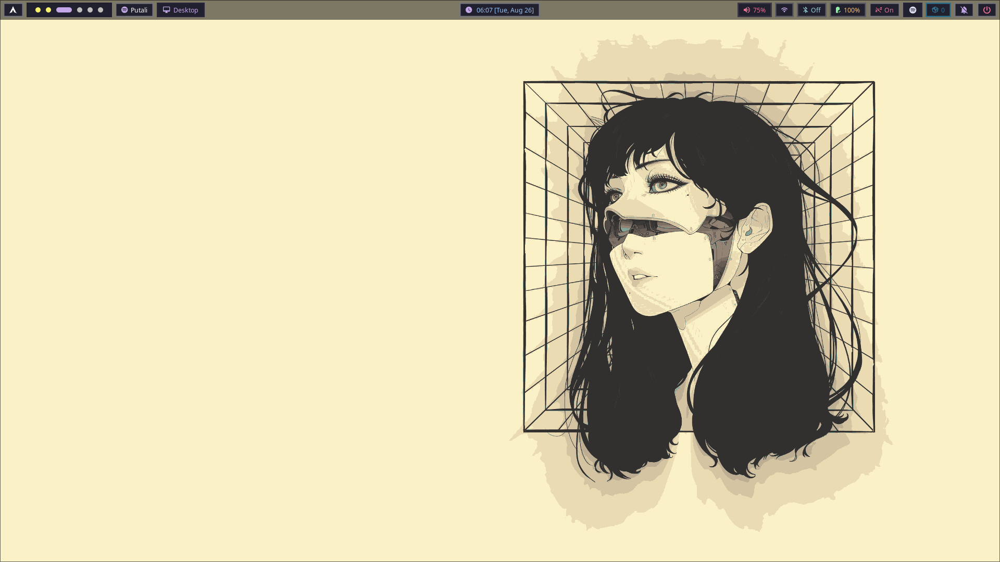
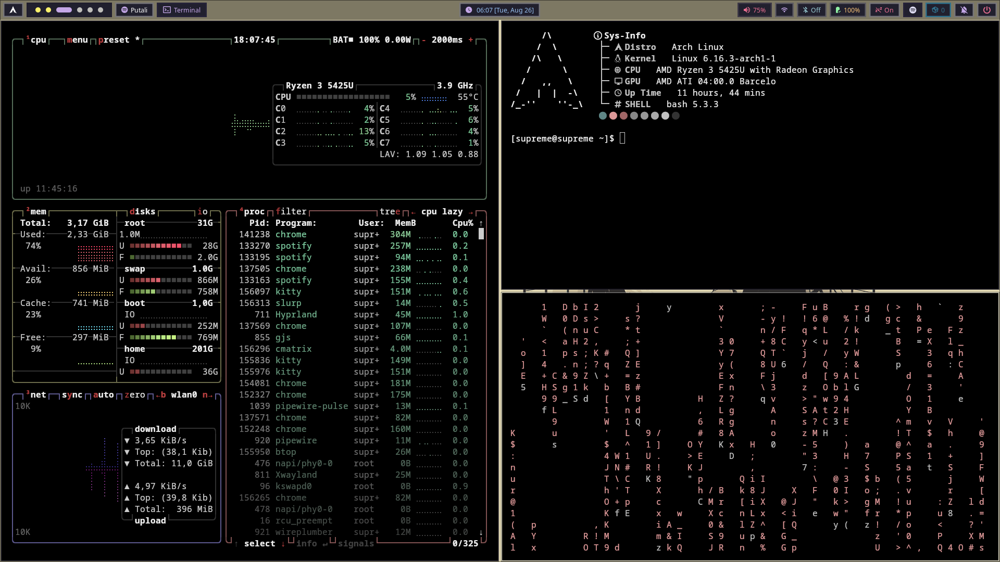
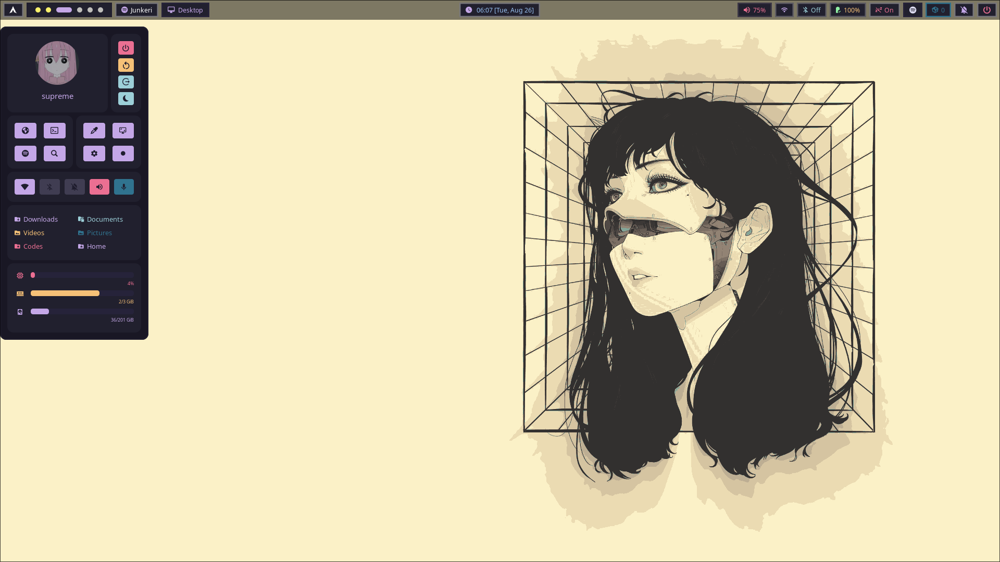

# Arch Dotfiles

This repository contains my personal dotfiles for **Hyprland**, **Neovim**, **kitty**, **Rofi**, **Starship**, **Waypaper**, and custom scripts like **floatpopup**.

> ⚠️ Most of these configs are adapted from existing sources.  
> Hyprland setup copied from: [Hyprpine Dots](https://github.com/alokftww/hyprpine-dots)  
> SDDM theme copied from: [Astronaut Theme](https://github.com/Keyitdev/sddm-astronaut-theme)

---

## Setup

Clone this repository:

    git clone https://github.com/supreMe7492/arch-dotfiles.git
    cd arch-dotfiles

Stow the configurations to your home directory:

    stow hypr
    stow kitty
    stow nvim
    stow rofi
    stow starship
    stow waypaper
    stow floatpopup

> ⚠️ Skip or modify any `stow` commands for configs you don’t want to use.

---

## Screenshots

  
  

---

## Notes

- Some files/scripts are copied as-is from other sources, with minor modifications (mostly shortcuts or tweaks).
- I do **not** stow my SDDM setup; see the link above if you want it.
- Floatpopup and Waypaper scripts are included; they require proper permissions (`chmod +x`) to run.

---

## License

You can copy or adapt these configs for personal use. No warranty—use at your own risk.
